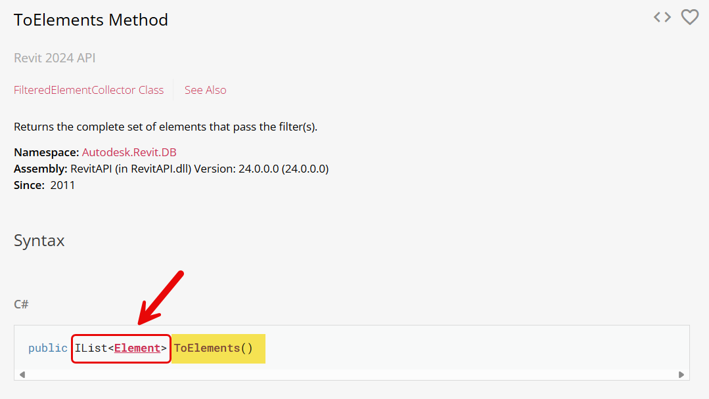
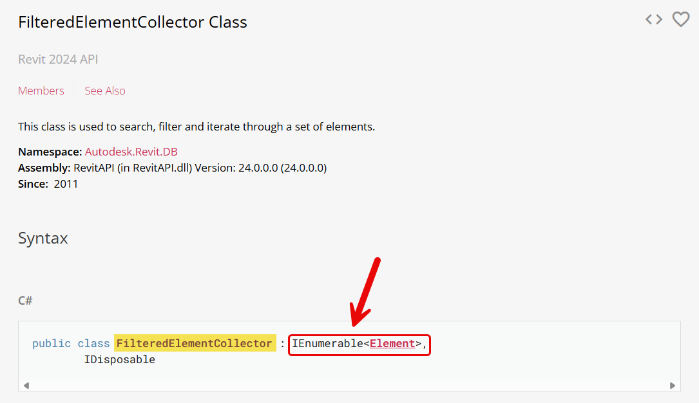

# Coleções de dados no System

As coleções do System em C# são estruturas de dados que permitem armazenar e gerenciar grupos de objetos. Aqui estão três das mais usadas:

* `IList<T>`: Uma interface que representa uma coleção de objetos que podem ser acessados por índice. Ela permite a
adição, remoção e modificação de elementos em posições específicas. Implementações comuns de `IList<T>` incluem `List<T>` e `Array`, oferecendo flexibilidade e controle sobre a ordem dos elementos na coleção.


* `List<T>`: É uma lista genérica que armazena elementos em uma ordem específica. Permite acesso rápido aos elementos
por índice e é útil quando a ordem dos itens é importante.


* `HashSet<T>`: É uma coleção que armazena elementos únicos, ou seja, não permite duplicatas. É ideal para cenários
onde a unicidade dos elementos é crucial e a ordem não importa.


* `Dictionary<TKey, TValue>`: É uma coleção de pares chave-valor. Cada chave deve ser única, e é usada para acessar o
valor correspondente. É útil quando você precisa mapear uma chave para um valor específico.


* `IEnumerable`: É uma interface que define um enumerador para iterar sobre uma coleção. Ela fornece uma maneira de
acessar sequencialmente os elementos de uma coleção sem expor os detalhes internos. É útil quando você deseja implementar a iteração personalizada em suas próprias coleções ou quando precisa trabalhar com qualquer coleção que suporte a iteração, como arrays ou listas.

Essas coleções são fundamentais para manipulação eficiente de dados em C#.

A API do Revit utiliza algumas destas coleções em seus métodos e propriedades.

As mais comuns são `List<T>`, `IList<T>` e `IEnumerable`






> **Como usar no IronPython**

```python
# Import System Libraries
import clr
clr.AddReference("System.Core")
from System.Collections.Generic import List as SystemList
from System.Collections.Generic import HashSet
from System.Collections.Generic import Dictionary
```
