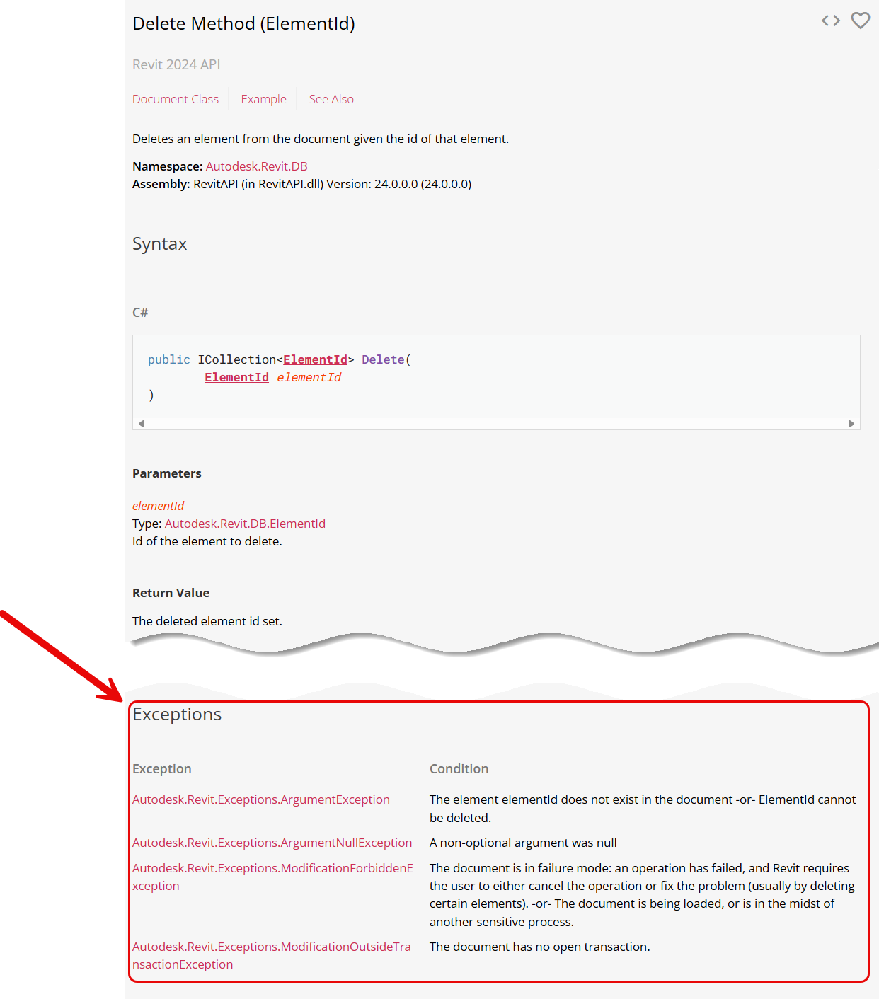

# Capturando erros do Revit

Algumas vezes será necessário criar um bloco de código para tratar alguma exceção lançada pelo Revit.

A maneira de fazer isso é muito parecida com o o que foi mostrado sobre `try/except`. Porém, teremos que especificar a 
Exceção do 
Revit que queremos capturar, ao invés de uma do sistema.

### Exemplo de Código:

Vamos criar um exemplo simples que tenta acessar um parâmetro de um elemento do Revit e captura exceções específicas relacionadas a isso.


```python
import clr
clr.AddReference("RevitAPI")
from Autodesk.Revit.DB import *
from Autodesk.Revit import Exceptions as RevitExceptions

import clr
clr.AddReference('RevitAPI')
from Autodesk.Revit.DB import *
from Autodesk.Revit import Exceptions as RevitExceptions

def deletar_elemento(doc, elemento_id):
    try:
        # Iniciar uma transação
        with Transaction(doc, "Deletar Elemento") as transacao:
            transacao.Start()
            
            elemento = doc.GetElement(elemento_id)
            if elemento is None:
                raise ValueError(f"Elemento com ID {elemento_id} não encontrado.")
            
            doc.Delete(elemento_id)
            transacao.Commit()
            print(f"Elemento com ID {elemento_id} deletado com sucesso.")
    
    except RevitExceptions.ArgumentNullException as e:
        print(f"Erro do Revit: Argumento nulo. Detalhes: {e}")
    except RevitExceptions.ArgumentException as e:
        print(f"Erro do Revit: Argumento inválido. Detalhes: {e}")
    except RevitExceptions.ModificationForbiddenException as e:
        print(f"Erro do Revit: Modificação proibida. Detalhes: {e}")
    except RevitExceptions.ModificationOutsideTransactionException as e:
        print(f"Erro do Revit: Modificação fora da transação. Detalhes: {e}")
    except ValueError as e:
        print(f"Erro: {e}")
    except Exception as e:
        print(f"Ocorreu um erro inesperado: {e}")
```

Na documentação da API do Revit podemos encontrar a lista de exceções padrão que o método pode lançar.



> **Isso não quer dizer que o método pode lançar somente essas. Elas são apenas as** **pré-definidas** **nele.**


