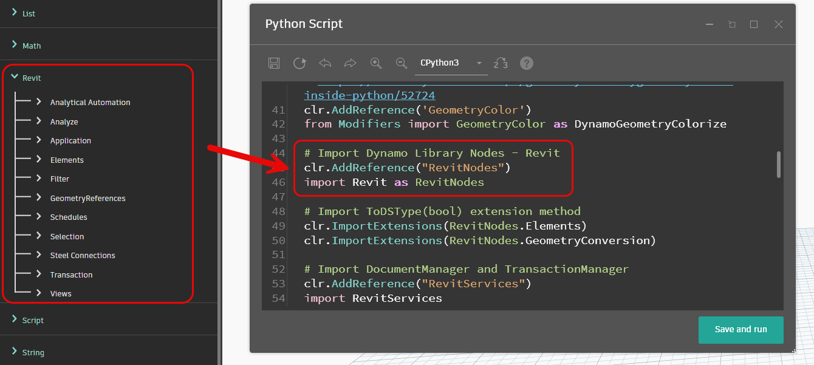
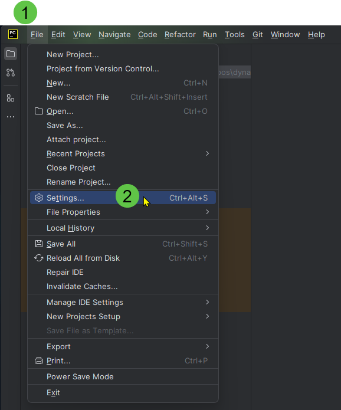

# Template Python onBIM

O template Python onBIM é um arquivo Python que contém um conjunto de imports e
unções, comumente utilizadas em scripts para programar para a API do Revit.

Ele é dividido em seções que facilitam a organização do código e a compreensão do que cada parte do código faz.

Seções do template onBIM:
- **Header** (contém informações sobre o arquivo)
- **References and Imports** (contém as referências e imports necessários)
- **Classes and Functions** (contém as funções e classes)
- **Inputs and Variables Declarations** (contém as declarações de variáveis e inputs)
- **Main Code** (contém o código principal)

```python
# by onBIM Technology
# www.onbim.net
# file name: ./${DIR_PATH}/${FILE_NAME}

# REFERENCES AND IMPORTS
# BEGIN>>>>>

# <<< Python Modules >>>
# BEGIN

# REFERENCES AND IMPORTS
# END<<<<<

# CLASSES AND FUNCTIONS
# BEGIN>>>>>

# <<< Your classes and functions here >>>

# CLASSES AND FUNCTIONS
# END<<<<<

# INPUTS AND VARIABLES DECLARATIONS
# BEGIN>>>>>

# INPUTS AND VARIABLES DECLARATIONS
# END<<<<<

# MAIN CODE
# BEGIN>>>>>

# MAIN CODE
# END<<<<<
```
## Explicação linha a linha

### Imports

```python
import clr
```
**Importa o módulo de Common Language Runtime (CLR) do Python.**

Esse módulo é necessário para importar as demais bibliotecas que não são do Python, como referências para o .NET,
API do Revit e do Dynamo.

```python
import System
```
**Importa o módulo System do Windows.**

Esse módulo é necessário para importar as classes e funções do .NET.

```python
import traceback
```
**Importa o módulo traceback.**

Esse módulo é necessário para imprimir mensagens de erro no console.

```python
clr.AddReference("System.Core")
from System.Collections.Generic import List as SystemList
```
**Adiciona a referência para List do .NET.**

Perceba é usado o _alias_ `SystemList` para evitar conflitos com a classe List de outras bibliotecas.

```python
clr.ImportExtensions(System.Linq)
```
**Importa os métodos de extensão do LINQ.**

Linq é uma biblioteca do .NET que permite realizar consultas em coleções de objetos.

[//]: # (TODO: Adicionar link do tópico e o texto Faleremos mais sobre LINQ no tópico. )

```python
clr.AddReference('ProtoGeometry')
from Autodesk.DesignScript import Geometry as DynamoGeometry
```
**Adiciona referência para os nodes de Geometria do Dynamo.**

Com esse import você poderá usar os nodes de geometria do Dynamo no seu script.


```python
clr.AddReference('DSCoreNodes')
from DSCore import List as DynamoList
```
**Adiciona referência para os _nodes_ de Listas do Dynamo.**


```python
clr.AddReference('DSCoreNodes')
from DSCore import Color as DynamoColor
```
**Adiciona referência para os _nodes_ de Cores do Dynamo.**


```python
clr.AddReference('GeometryColor')
from Modifiers import GeometryColor as DynamoGeometryColorize
```
**Adiciona referência para os _nodes_ de Colorização de Geometria do Dynamo.**


```python
clr.AddReference("RevitNodes")
import Revit as RevitNodes
```
**Adiciona referência para os _nodes_ de Revit do Dynamo.**



```python
clr.ImportExtensions(RevitNodes.Elements)
clr.ImportExtensions(RevitNodes.GeometryConversion)
```
**Importa os métodos de extensão para conversão de Elementos e Geometria entre o Revit e o Dynamo.**

```python
clr.AddReference("RevitServices")
import RevitServices
from RevitServices.Persistence import DocumentManager
from RevitServices.Transactions import TransactionManager
```
**Adiciona referência para os serviços do Dynamo que permitem acessar o documento do Revit e gerenciar transações.**

- O documento do Revit é o arquivo de projeto que está sendo editado.
- As transações são operações necessárias para alterar o modelo do Revit.

```python
clr.AddReference("RevitAPI")
import Autodesk
from Autodesk.Revit.DB import *
```
**Adiciona referência para a API do Revit.**

A API do Revit é um conjunto de classes e métodos que permitem acessar e modificar o modelo do Revit.

```python
clr.AddReference("RevitAPIUI")
from Autodesk.Revit.UI import *
```
**Adiciona referência para a interface de usuário da API do Revit.**

Essa biblioteca permite criar janelas, barras de ferramentas e outros elementos de interface gráfica.

```python
clr.AddReference('RevitAPIIFC')
from Autodesk.Revit.DB.IFC import *
```
**Adiciona referência para a API IFC do Revit.**

Essa biblioteca permite acessar recursos especiais para importação e exportação de arquivos IFC.

Esses recursos podem ser utilizados também para manipular elementos nativos do Revit

```python
clr.AddReference('DynamoServices')
from Dynamo import Events as DynamoEvents
```
**Adiciona referência para os eventos do Dynamo.**

Uma das coisas importantes que dá para capturar com esses eventos é o acesso ao Documento do Dynamo, como mostrado
abaixo:

```python
workspaceFullPath = DynamoEvents.ExecutionEvents.ActiveSession.CurrentWorkspacePath
workspacePath = '\\'.join(workspaceFullPath.split('\\')[0:-1])
```
### Variáveis que dão acesso a recursos do Revit.

```python
doc = DocumentManager.Instance.CurrentDBDocument
uidoc = DocumentManager.Instance.CurrentUIApplication.ActiveUIDocument
app = uiapp.Application
uiapp = DocumentManager.Instance.CurrentUIApplication
```

- `doc` é o documento ativo no Revit. O modelo que está aberto no momento e que o Dynamo está apontando.


- `uidoc` Dá acesso a recursos da interface do Documento ativo no Revit. Com essa variável podemos acessar coisas
  como a seleção de elementos, a vista ativa, etc.


- `app` é a aplicação do Revit. Dá acesso ao Revit como aplicação. Nessa variável podemos encontrar coisas como
  a versão do Revit, o idioma, etc.


- `uiapp` Dá acesso a recursos da interface do Revit. Com essa variável podemos acessar coisas como a barra de
  ferramentas, janelas, etc.

### Variáveis de input e output

```python
inputFromDynamo = IN[0]

result = []
```

### Código principal

```python
try:
  errorReport = None

  # transaction
  TransactionManager.Instance.EnsureInTransaction(doc)

  # Your Code Here

  TransactionManager.Instance.TransactionTaskDone()

except Exception as e:
  # if error occurs anywhere in the process catch it
  errorReport = traceback.format_exc()

# Assign your output to the OUT variable
if errorReport is None:
  OUT = result
else:
  OUT = errorReport
```

> Só é necessário usar uma `Trasaction` se você for alterar o modelo do Revit. 
> 
> Caso contrário, pode apagar as linhas
> 
> `TransactionManager.Instance.EnsureInTransaction(doc)`
> 
> `TransactionManager.Instance.TransactionTaskDone()`.
> 
{style="note"}

## Como usar o Template no PyCharm

Baixe o arquivo do template no link abaixo:

### **Template onBIM para IronPython do Dynamo do Revit** {collapsible="true"}
```python
# by onBIM Technology
# www.onbim.net
# file name: ./${DIR_PATH}/${FILE_NAME}

# REFERENCES AND IMPORTS
# BEGIN>>>>>

import clr
import System

# <<< Python Modules >>>
# BEGIN

# Import traceback module from Iron Python
import traceback

# END

# Import System Libraries
clr.AddReference("System.Core")
from System.Collections.Generic import List as SystemList

# Import Linq
clr.ImportExtensions(System.Linq)

# Import Dynamo Library Nodes - Geometry
clr.AddReference('ProtoGeometry')
from Autodesk.DesignScript import Geometry as DynamoGeometry

# Import Dynamo Library Nodes - Core
clr.AddReference('DSCoreNodes')
from DSCore import List as DynamoList

# Import Dynamo Library Nodes - Core
clr.AddReference('DSCoreNodes')
from DSCore import Color as DynamoColor

# Import Dynamo Geometry Color
# https://forum.dynamobim.com/t/geometrycolor-bygeometrycolor-inside-python/52724
clr.AddReference('GeometryColor')
from Modifiers import GeometryColor as DynamoGeometryColorize

# Import Dynamo Library Nodes - Revit
clr.AddReference("RevitNodes")
import Revit as RevitNodes

# Import ToDSType(bool) extension method
clr.ImportExtensions(RevitNodes.Elements)
clr.ImportExtensions(RevitNodes.GeometryConversion)

# Import DocumentManager and TransactionManager
clr.AddReference("RevitServices")
import RevitServices
from RevitServices.Persistence import DocumentManager
from RevitServices.Transactions import TransactionManager

# Import Revit API
clr.AddReference("RevitAPI")
import Autodesk
from Autodesk.Revit.DB import *

# Import Revit User Interface API
clr.AddReference("RevitAPIUI")
from Autodesk.Revit.UI import *

# Import Revit IFC API
# https://forum.dynamobim.com/t/ifcexportutils/4833/7?u=ricardo_freitas
clr.AddReference('RevitAPIIFC')
from Autodesk.Revit.DB.IFC import *

# Import Dynamo Services
clr.AddReference('DynamoServices')
from Dynamo import Events as DynamoEvents

# Active Dynamo Workspace Path
workspaceFullPath = DynamoEvents.ExecutionEvents.ActiveSession.CurrentWorkspacePath
workspacePath = '\\'.join(workspaceFullPath.split('\\')[0:-1])

# REFERENCES AND IMPORTS
# END<<<<<

# FUNCTIONS
# BEGIN>>>>>

# <<< Your classes and functions here >>>

# FUNCTIONS
# END<<<<<

# INPUTS AND VARIABLES DECLARATIONS
# BEGIN>>>>>

doc = DocumentManager.Instance.CurrentDBDocument
uiapp = DocumentManager.Instance.CurrentUIApplication
app = uiapp.Application
uidoc = DocumentManager.Instance.CurrentUIApplication.ActiveUIDocument

inputFromDynamo = IN[0]

result = []

# INPUTS AND VARIABLES DECLARATIONS
# END<<<<<

# MAIN CODE
# BEGIN>>>>>

try:
    errorReport = None
    
    # transaction
    TransactionManager.Instance.EnsureInTransaction(doc)
    
    # Your Code Here
    
    TransactionManager.Instance.TransactionTaskDone()

except Exception as e:
    # if error occurs anywhere in the process catch it
    errorReport = traceback.format_exc()

# Assign your output to the OUT variable
if errorReport is None:
    OUT = result
else:
    OUT = errorReport
# MAIN CODE
# END<<<<<
```

### Configuração

1. Clique no menu `File`
2. Selecione `Settings`
3. Na janela de configurações, expanda o item `Editor`
4. Selecione `File and Code Templates`
5. Clique no botão `+` para adicionar um novo template
6. Digite um nome para seu template
7. Cole o conteúdo do arquivo `onBIM Template.py` no campo de texto
8. Clique em `Apply` e depois em `OK`

 {style="block"}

 {style="block"}

 {style="block"}

### Criando um novo arquivo a partir do Template

1. Clique com o botão direito na pasta onde deseja criar o arquivo
2. Selecione `New`
3. Selecione o nome do template que você criou
4. Digite o nome do novo arquivo e clique em `OK`


