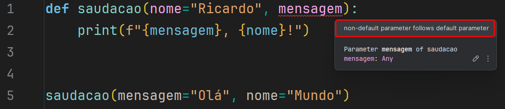

# Funções em Python

## Definição

Uma função em Python é um bloco de código **reutilizável** que realiza uma tarefa específica.

Você define uma função usando a palavra-chave `def`, seguida pelo nome da função e parênteses, que podem conter _**argumentos**_.

Dentro do bloco de código, você coloca as instruções que a função executará. Por exemplo:

```python
def saudacao(nome):
    print(f"Olá, {nome}!")

saudacao("Mundo")
```

> Uma função pode ou não retornar um valor. Se quisermos que a função retorne um valor, usamos a palavra-chave `return`.
> 
{style="note"}

```python
def soma(a, b):
    return a + b

# Passando o resultado da função para uma variável
resultado = soma(2, 3)

print(resultado)  # Isso imprimirá 5
```

> No caso de funções que não retornam valores, o Python retornará `None` por padrão.
>
{style="note"}

```python
def saudacao(nome):
    print(f"Olá, {nome}!")
    
resultado = saudacao("Mundo")

print(resultado)  # Isso imprimirá None
```

### Argumentos

Os argumentos de uma função em Python são valores que você passa para a função quando a chama.

Esses valores são usados pela função para executar suas tarefas. Por exemplo, se você tem uma função que

soma dois números, os argumentos seriam esses dois números.

Aqui está um exemplo:

```python
def soma(a, b):
    return a + b

resultado = soma(2, 3)
print(resultado)  # Isso imprimirá 5
```

Neste caso, `a` e `b` são os argumentos da função `soma`.

### Número de Argumentos

De forma predeterminada, se deve chamar uma função com o número correto de argumentos.

Isso significa que se uma função espera dois argumentos, você deve passar dois argumentos ao chamá-la.

Se você passar mais ou menos argumentos, o Python lançará um erro.

```python
# Exemplo de função com número incorreto de argumentos

def subtracao(a, b):
    return a - b


# Tentativa de chamar a função com apenas um argumento
try:
    resultado = subtracao(10)
except TypeError as e:
    print(f"Erro: {e}")

# Tentativa de chamar a função com três argumentos
try:
    resultado = subtracao(10, 5, 2)
except TypeError as e:
    print(f"Erro: {e}")

# Chamada correta da função com dois argumentos
resultado = subtracao(10, 5)
print(f"Resultado correto: {resultado}")
```

> Esse tipo de erro também ocorrerá quando utilizarmos a API do Revit
> e não passarmos os argumentos corretos para os métodos.
>
{style="note"}

### Número variável de argumentos

Às vezes, você pode querer que uma função aceite um número arbitrário de argumentos.

Para fazer isso, você pode usar o operador `*` antes do nome do argumento na definição da função.

```python
def soma(*numeros):
    total = 0
    for numero in numeros:
        total += numero
    return total

resultado = soma(1, 2, 3, 4, 5)

print(resultado)  # Isso imprimirá 15
```

### Argumentos Nomeados

Em Python, você também pode chamar a função com argumentos nomeados.

Isso permite que você passe os argumentos em qualquer ordem, desde que você os nomeie.

```python
def saudacao(nome, mensagem):
    print(f"{mensagem}, {nome}!")

saudacao(mensagem="Olá", nome="Mundo")
```

### Argumentos com valor padrão

Você pode definir um valor padrão para um argumento de função em Python.

Se você chamar a função sem passar um valor para esse argumento, o Python usará o valor padrão.

```python
def saudacao(nome="Mundo"):
    print(f"Olá, {nome}!")

saudacao()  # Isso imprimirá "Olá, Mundo!"

saudacao("Python")  # Isso imprimirá "Olá, Python!"
```

> Só podemos definir argumentos com valores padrão após os argumentos sem valor padrão.
>
{style="warning"}



### Retorno de múltiplos valores

Em Python, você pode retornar múltiplos valores de uma função.

Para fazer isso, você pode simplesmente retornar uma tupla de valores.

```python
def quatro_operacoes(a, b):
    return a + b, a - b, a * b, a / b
```

### Argumentos que são outras funções

Em Python, funções podem ser passadas como argumentos para outras funções.

```python
def operacoes(a, b, soma_func, subtracao_func, multiplicacao_func, divisao_func):
    soma = soma_func(a, b)
    subtracao = subtracao_func(a, b)
    multiplicacao = multiplicacao_func(a, b)
    divisao = divisao_func(a, b)
    
    print(f"Soma: {soma}")
    print(f"Subtração: {subtracao}")
    print(f"Multiplicação: {multiplicacao}")
    print(f"Divisão: {divisao}")

def soma(a, b):
    return a + b

def subtracao(a, b):
    return a - b

def multiplicacao(a, b):
    return a * b

def divisao(a, b):
    return a / b

# Exemplo de uso
operacoes(10, 5, soma, subtracao, multiplicacao, divisao)
```
### Garantir iterabilidade de Python Scripts no Dynamo

Para garantir que nossos inputs sejam iteráveis, podemos usar a função `ToList`.

```python
# Opção 1
def ToList(obj):
    if hasattr(obj, "__iter__"):
        return obj
    else:
        return [obj]

# Opção 2
def ToList(obj):
    if isinstance(obj, list):
        return obj
    else:
        return [obj]
```

## Exercício

Melhorar a execução do código feito no [exercício de cálculo da equação do segundo grau](Texto.md#eq-segundo-grau-com-texto). 
Porém, agora usando funções.


